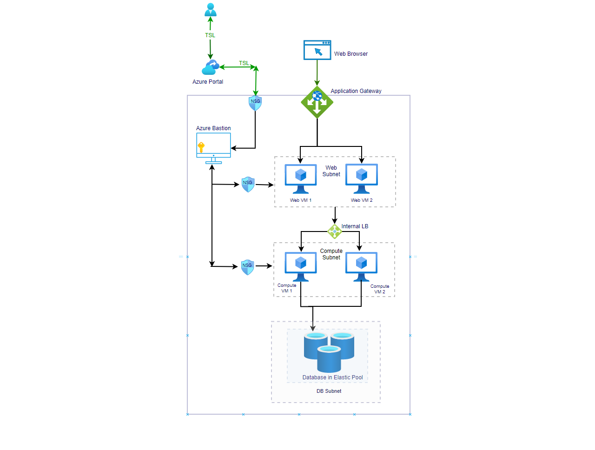

## Design and Deployment of 3 tier architecture in azure using terraform.

### Challenge1 

Develop 3 tier architecture on public cloud platform.

## What is three-tier architecture?
Three-tier architecture is a well-established software application architecture that organizes applications into three logical and physical computing tiers: the presentation tier, or user interface; the application tier, where data is processed; and the data tier, where the data associated with the application is stored and managed.

## What is terraform?
Terraform is an open-source infrastructure as code software tool created by HashiCorp. Users define and provision data center infrastructure using a declarative configuration language known as HashiCorp Configuration Language, or optionally JSON.

## Installation
- [Terraform](https://www.terraform.io/downloads.html)

## Pre requisite to build the solution
- Azure  subscription.
- Azure service principle 
- Terraform open source installed ,azure CLI /powershell

## Architecture of solution to be deployed

The following diagram shows the high level deployment architecture:



### Archictrue Components and layers.
 Following are main architecture components

   **1) Database Layer** `Azure PASS database with elastic pool`. Elastic pools are a simple, cost-effective solution for managing and scaling multiple databases that have              varying usage demands. So to avoid under utilization of database during non peak hours elastic pool solution can be very effective to minimize cost and provide                  autoscaling during heavy workload. This soultion is very flexible as it is  very easy to upgrade /downgrade elstic pool configuration and db can be moved out of elastic          pool if usage pattern changes. 
 
   **2) Compute Layer** `Azure linux Virtual Machines (with availability set) with internal load balancer `
 
   **3) Web Layer** `Azure windows  Virtual Machines with availability set) which will act as web server`
 
   **4) Application Gateway** `Application Gateway is web traffic load balancer`. Application gatway offers SSL termination, URL-based routing, multi-site routing, Cookie-based         session affinity and Web Application Firewall (WAF) features hence offers additional security when web servers are accessed via public url through application gateway.
  
  **5) Azure Bastion** `Azure bastion`. It is PAAS service which offers more secure , seamless RDP/SSH connectivity to your VMs directly in the Azure portal over SSL. Virtual            machine which manages software can be only private IP and can only be physically accessible via Azure Bastion.
  
   
 
 ## Development of Architecture:-
  Terraform open source is used to develop provisioning of infrastrcutre and modules are created for provisioning of resoruces in each layer. Module structure of code is           explained as below
  
          
```      
├── main.tf                   // The root module which calls sub modules sequentially for terraform resources provisoning.
├── vars.tf                   // It contain the declarations for variables.
├── output.tf                 // It contain the declarations for outputs.
├── terraform.tfvars          // The file to pass the terraform variables values.
    ├── modules               // Directory contains all sub modules to provision all components of 3 tier architecture
        ├──resourcegroup      // Module to ensure provisioning of resource  group
           ├── main.tf        // main set of  configuration to provision resource group.
           ├── variable.tf    // Declaration variables for resource group.
           ├── output.tf      // Declaration of output variables to after provisioning resource group.
        ├──network            // Module to create provisioning of network (vnet and subnet)
           ├── main.tf        // main set of  configuration to provision networking resources.
           ├── variable.tf    // Declaration variables reuqired to create network resources.
           ├── output.tf      // Declaration of output variables(subnet id's) to after provisioning network resources.
        ├──database           // Module to create database with elastic pool to form data layer of architecture
           ├── main.tf        // main set of  configuration to provision database resources(db server, elastic pool, database ).
           ├── variable.tf    // Declaration variables reuqired to create database resources.
        ├──compute            // Module to create business(compute) layer of 3 tier architecture
           ├── main.tf        // main set of  configuration to provision compute resources (linux VM's, NIC, Availability set,priavate key etc).
           ├── variable.tf    // Declaration variables reuqired to create network resources.
           ├── security.tf    // Creation and rule setup for network security group (NSG) for compute server
        ├──web                // Module to UI (presentation) layer of 3 tier architecture
           ├── main.tf        // main set of  configuration to provision compute resources (windows VM's, NIC, Availability set, etc).
           ├── variable.tf    // Declaration variables reuqired to create network resources.
           ├── output.tf      // Declaration of output variables(NIC IP address of web server) to after provisioning network resources.
           ├── security.tf    // Creation and rule setup for network security group (NSG) for web server
        ├──bastion            // Module to create azure  bastion host to seucrely connect web and compute resources
           ├── main.tf        // main set of  configuration to provision bastion VM
           ├── variable.tf    // Declaration variables reuqired to create bastion resources.
           ├── security.tf    // Creation and rule setup for network security group (NSG) for bastion.
        ├──appgateway         // Module to create application gatway to securly connect and provide http routing for we layer from bworser
           ├── main.tf        // main set of  configuration to provision application gateway resources and configure rules
           ├── variable.tf    // Declaration variables reuqired to create and condifugre application gateway.
        ├──keyvault           // Module to store database password, virtual machine login password and key securly in azure key vault secrete 
           ├── main.tf        // main set of  configuration to create secrete for stroring password in key vault.
           ├── variable.tf    // Declaration variables reuqired to secrete in key vault.
  ```
           


      
 ## Deployment of Architecture:-
   
   ### Steps

   **Step 0** `terraform init`

   used to initialize a working directory containing Terraform configuration files

   **Step 1** `terraform plan`

   used to create an execution plan

   **Step 2** `terraform validate`

   validates the configuration files in a directory, referring only to the configuration and not accessing any remote services such as remote state, provider APIs, etc

   **Step 3** `terraform apply`

   used to apply the changes required to reach the desired state of the configuration
     
   


 
 
